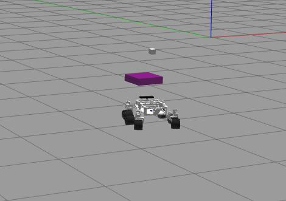

# Vision-Based Robot Navigation with Deep RL

## OVERVIEW
This repository documents my personal experimentation with Computer Vision (CV) while learning reinforcement learning (RL). It contains pipeline for training a mobile robot to navigate towards a visual goal marker in an empty Gazebo world using Deep Reinforcement Learning (Deep RL) integrated with ROS 2. This implementation trains the agent to preprocess camera feeds and map pixels directly to action.

Only visual observations from an onboard camera and ground-truth odometry (solely for reward computation and evaluation, not as a policy input) are used to train an agent using Proximal Policy Optimization (PPO) algorithm for continuous action space. Deep Q-Network (DQN) algorithm scripts are also available in this repo for mapping image pixels to discrete action space. A custom Gymnasium-like wrapper bridges ROS 2 topics with these RL algorithms.

<div align="center">
<div align ="center">
  
  
</div>
</div>

## KEY FEATURES
- **Incremental Training Strategy**: Designed to be trained gradually, beginning with an empty environment and random spawning of the goal at distances between 2m to 8m.
- **End-to-End Vision-Based Navigation**: Utilizes a Convolutional Neural Network (CNN) backbone (Nature CNN architecture) to process a stack of 4 resized (84x84) camera frames for temporal and spatial cues.
- **Deep Reinforcement Learning**: Includes a custom implementation of PPO specifically tuned for continuous action space `[-1, 1]` mapped to physical velocities. Implementations with DQN and Double DQN are also available for discrete action spaces.
- **Gym-ROS 2 Integration**: Custom wrapper that translates ROS 2 `/cmd_vel` actions and `/camera/image_raw` callbacks into Gym interface.
- **Multi-Component Reward Shaping**: Dense reward structures broken down into Goal completion, Navigation quality, Efficiency, Behavior, and Failure prevention.
- **Diagnostic Logging**: Full TensorBoard integration capturing rewards, losses, actions, and custom environment metrics.

## REPOSITORY STRUCTURE

### CORE REINFORCEMENT LEARNING FLOW
- `main_train.py`: The primary entry point for training the PPO agent in the ROS 2 environment. Handles logging, environment stepping, rendering, and PPO updates.
- `_7_env_ros2.py`: The `RosVisionEnv` Gymnasium environment wrapper handling ROS 2 subscriptions (Odometry, Camera) and publishers (Velocity).
- `_5_ppo_agent.py`: Implementation of the PPO (Proximal Policy Optimization) agent with advantage calculation, clipping, and entropy bonuses.
- `_6_reward.py`: Highly shaped reward function designed to balance search exploration, alignment, distance progression, and safety.
- `rollout_buffer.py`: Replay buffer for PPO trajectory storage and advantage estimation (GAE).

### NEURAL NETWORK POLICIES
- `_4A_policy_cnn_ppo.py`: The primary continuous control Actor-Critic Nature CNN policy for PPO.
- `_4B_policy_cnn_dqn.py`: Alternative Deep Q-Network policy architecture.
- `_4C_policy_cnn_doubledqn.py`: Alternative Double DQN policy architecture.

### VISION & PERCEPTION
- `_1_camera_node.py`: ROS 2 Node dedicated to subscribing to camera images in a thread-safe manner using `cv_bridge`.
- `_2_preprocess.py`: Performs preprocessing/RGB standardization and scaling of the raw camera images.
- `_3_frame_stack.py`: Implements temporal frame stacking (e.g., k=4 frames) to provide the RL agent with velocity/momentum context.
- `vision_goal_utility.py`: HSV-based classical computer vision utilities for detecting the purple goal marker and calculating horizontal offsets.

### TESTING & UTILITIES
- `test_ppo_model.py`: Script to load trained checkpoints and evaluate the policy in the environment.
- `_8_spawn_goal.py` / `spawn_goal_testing.py` / `spawn_locations.py`: Scripts handling the dynamic spawning and resetting of goals within the simulation world (likely Gazebo).
- `nature_cnn_utility_visualize.ipynb`: Jupyter notebook for debugging and visualizing CNN feature extractions.
- `debug_camera.py` / `test_vision.py` / `utility_camera_image.py`: Helpful scripts to debug visual observations and frame sync issues.

## ARCHITECTURE

1. **Observation Space Structure**: Processed entirely from the RGB camera. The raw `96x128x3` image is spatially resized to `84x84`, normalized, and then temporally stacked with `k=4` frames. This provides a final single observation tensor of shape `4 x 3 x 84 x 84` (along with localized goal details during training). Ground truth odometry is **never** included in the policy observation space.
2. **Action Space Definition**: The policy outputs continuous, dimensionless normalized commands `[-1.0, 1.0]` for the linear and angular velocities. These are explicitly scaled to actual physical limits before execution to accommodate forward, backward, rotational, and curved trajectories.
3. **Actor-Critic Network**:
   - Uses Nature CNN architecture to extract latent features from the visual inputs.
   - Processed through fully connected layers to output a policy distribution (Diagonal Gaussian for PPO) and a baseline value for the critic.
   - Implemented value function clipping from the PPO paper

## REWARD FUNCTION DESIGN
In this setup, there are no obstacles, no map, and no localization in observation. There is only one task, i.e., to reach the visible goal marker. The agent must learn approach behaviour, heading control, and smooth motion. Therefore, the reward function must be dense, low dimensional, avoid unnecessary penalties, and avoid over-shaping.

Following are the conditions on which the rewards are assigned in (`_6_reward.py`):
- Terminal reward
- Distance progress
- Goal visibility
- Goal alignment
- Forward velocity
- Backward motion
- Exploration
- Situation where the robot is stuck
- Action smoothness
- Time
- Episode Timeout

## SYSTEM & DEVELOPMENTENVIRONMENT
Following is the list of tools and system on which this project was developed.
- **Operating System**: Ubuntu 22.04 LTS
- **ROS 2 Distribution**: ROS 2 Humble
- **Simulator**: Gazebo (Classic)
- **Python Version**: Python 3.11
- **GPU**: NVIDIA GeForce RTX 4080
- **CUDA**: 13.0
- **Deep Learning Framework**: PyTorch
- **Computer Vision**: OpenCV (`cv2`), `cv_bridge`
- **Reinforcement Learning**: Gymnasium
- **Logging**: TensorBoard
- **Core ROS 2 Packages**: `rclpy`, `geometry_msgs`, `sensor_msgs`, `std_srvs`, `nav_msgs`

## USAGE

### 1. LAUNCHING THE SIMULATION
Ensure that your corresponding ROS 2 simulated world (e.g., Gazebo) is running, featuring the robot with differential drive and a camera, as well as the purple goal marker. In my setup, I ran the following commands to launch the simulation, enable pose estimation, and collision detection.

```bash
clear; ros2 launch rover_gazebo empty_world.launch.py
clear; ros2 run gazebo_contact_bridge pose_bridge
clear; ros2 run gazebo_contact_bridge contact_bridge
```

### 2. TRAINING THE AGENT
Before running the training script, I ran the following script to spawn the goal marker at a random location within the environment.
```bash
clear; python3 _8_spawn_goal.py
```

To have a separate window for camera view, run the following script.
```bash
clear; python3 utility_camera_image.py
```

To train the PPO agent from scratch or resume from a checkpoint, mess around with the checkpoint config in main_train.py before starting the training. To start training, run the following in the terminal.
```bash
python3 main_train.py
```

- Training checkpoints will be dynamically saved in the `checkpoints/` directory.
- Logs will be saved to the `logs/` directory.
- Training metrics can be visualized using TensorBoard:
  ```bash
  tensorboard --logdir=tensorboard/
  ```

### 3. EVALUATING A MODEL
To observe a trained agent navigating the environment, one can choose from the following tests:
1. Quick Test (5 episodes) - Sanity check
2. Standard Test (50 episodes) - Main evaluation
3. Stress Test (100 episodes) - Statistical significance
4. Behavioral Analysis - Detailed single-episode study
5. Comparison Test - Multiple checkpoints

Usage Examples:
```bash
clear; python3 test_ppo_model.py --checkpoint checkpoints/ppo_best.pt --episodes 50
```
```bash
clear; python3 test_ppo_model.py --compare checkpoints/ppo_ep_00100.pt checkpoints/ppo_ep_01000.pt
```